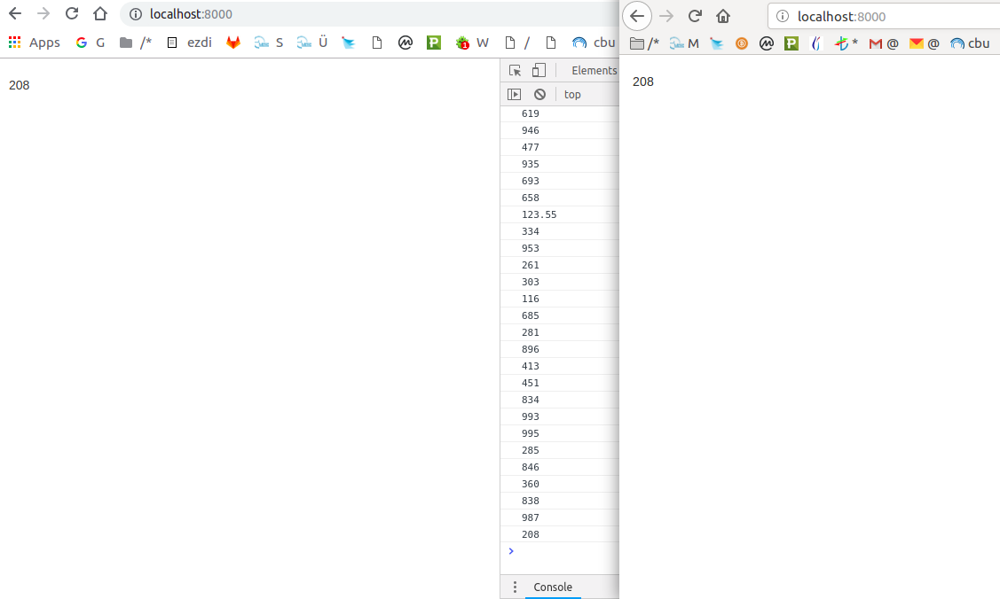

# Getting Started With Django Channels

Generate random numbers using Django, Channel and Celery structure.

## Want to learn how to build this project?

Check out the [blog post](https://mesebilisim.com/).

## Want to use this project?

1. Fork/Clone
2. Create and activate a virtualenv
3. Install the requirements
4. Apply the migrations
5. Install Redis (if necessary)
6. Run the server

## Example

